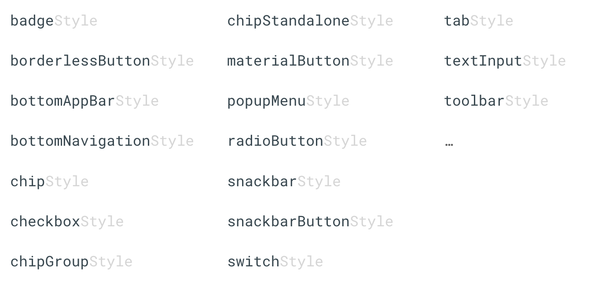
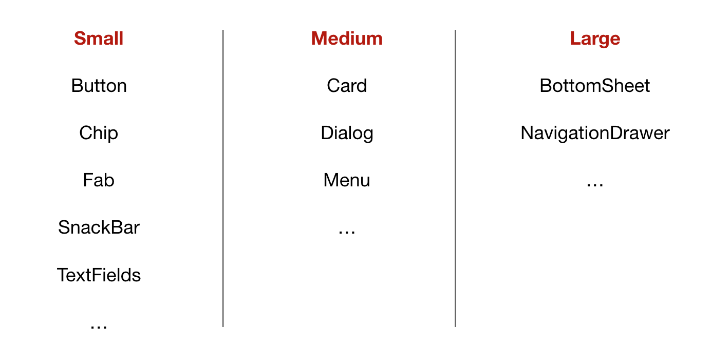

# KotlinBaseProject

A base code which I almost use in every project I work on!
It shows how to use ViewModels and Room together with Coroutines & Dagger by Clean Architecture in Kotlin!
This way you don`t need to repeat the same code in different parts of your project over & over.

    
### FAQ
---
#### 🤔 - What if i need to update library version?

☝️ - Before update you should read what new was added, or it can brake your functionality (for android libraries [link](https://developer.android.com/jetpack/androidx/versions/all-channel)) 

---

### Ktlint
We can improve Check&Fix Kotlin code style via using [ktlint](https://ktlint.github.io/)

Command for Windows : java -jar ktlint -F

### Gradle Kotlin DSL (Domain-specific language)
for gradle i am using [Kotlin DSL](https://docs.gradle.org/current/userguide/kotlin_dsl.html) that provide me some benefits :
* statically typed & type-safe DSL
* first-class functions, extension methods
* IDE auto-compete and content assist
* it’s easier to start doing more complicated things
* the errors are detected by the compiler
* imports added automatically

### Custom Lint Rule
Default set of lint rules is limited and in some situations we could benefit from creating custom rules that identify issues that are specific to our projects. [Help link](https://www.youtube.com/watch?v=jCmJWOkjbM0)

### Testing

If we want to mock final/private classes we should add special [file](https://github.com/mockito/mockito/wiki/What's-new-in-Mockito-2#mock-the-unmockable-opt-in-mocking-of-final-classesmethods) to our project 

### Dagger 2 with ViewModel that have SavedState

i'm using the best DI scenario for ViewModel that i have ever seen in my life (took that from this [video](https://youtu.be/9fn5s8_CYJI?list=LLMBNl1baSJfDak1Lo2VVVZQ))
 and slightly modifying by adding [AssistedInjection](https://github.com/square/AssistedInject) 
 for supporting SavedStateModule (When providing a custom ViewModelProvider.Factory instance, 
 you can enable usage of SavedStateHandle by extending AbstractSavedStateViewModelFactory)

### Architecture

cool picture

### About Theme

* if you want to use Material Components look here for [basic](https://github.com/material-components/material-components-android/blob/master/docs/getting-started.md#4-change-your-app-theme-to-inherit-from-a-material-components-theme)
* specific text sizes for [text](https://material.io/develop/android/theming/typography/)
* about [MaterialAlertDialog](https://github.com/material-components/material-components-android/blob/master/docs/components/Dialog.md)
* for every standard component exist special attribute in theme

so we can override it in our theme for personalization

* each view component belongs to a specific group 
    * shapeAppearanceSmallComponent
    * shapeAppearanceMediumComponent
    * shapeAppearanceLargeComponent

we can build our own shape appearance by following these [attributes](https://material.io/develop/android/theming/shape/)
* if we want to change theme from light to night 
    * AppCompatDelegate.setDefaultNightMode(AppCompatDelegate.MODE_NIGHT_NO) - For light Theme
    * AppCompatDelegate.setDefaultNightMode(AppCompatDelegate.MODE_NIGHT_YES) - For dark Theme
    * AppCompatDelegate.setDefaultNightMode(AppCompatDelegate.MODE_NIGHT_AUTO_BATTERY)
    * AppCompatDelegate.setDefaultNightMode(AppCompatDelegate.MODE_NIGHT_FOLLOW_SYSTEM) 
* read about [tinting](https://github.com/android/graphics-samples) drawables

### Libraries Used
#### if you do need specific library feel fre to delete it from build.gradle.kts 'dependencies' section
* [Foundation](https://developer.android.com/jetpack/components) - Components for core system capabilities, Kotlin extensions and support for multidex and automated testing.
    * [AppCompat](https://developer.android.com/topic/libraries/support-library/packages#v7-appcompat) - Degrade gracefully on older versions of Android.
    * [Android KTX](https://developer.android.com/kotlin/ktx/extensions-list) - Write more concise, idiomatic Kotlin code.
    * [Material](https://material.io/components/) - Build beautiful products, faster.
* [Architecture](https://developer.android.com/jetpack/arch/) - A collection of libraries that help you design robust, testable, and maintainable apps. 
    * [Data Binding](https://developer.android.com/topic/libraries/data-binding/) - Declaratively bind observable data to UI elements.
    * [Lifecycles](https://developer.android.com/topic/libraries/architecture/lifecycle) - Create a UI that automatically responds to lifecycle events.
