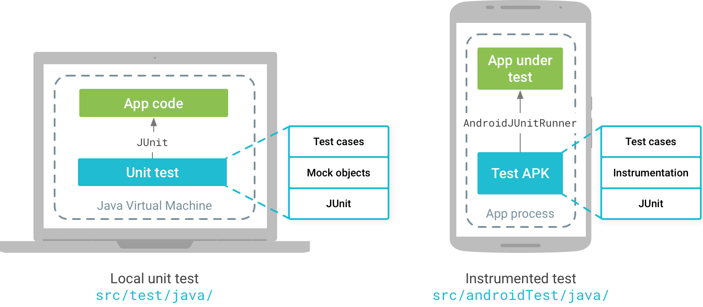

# KotlinBaseProject

A base code which I almost use in every project I work on!
It shows how to use ViewModels and Room together with Coroutines & Dagger by Clean Architecture in Kotlin!
This way you don`t need to repeat the same code in different parts of your project over & over.

### Architecture

### About Theme

* if you want to use Material Components look here for [basic](https://github.com/material-components/material-components-android/blob/master/docs/getting-started.md#4-change-your-app-theme-to-inherit-from-a-material-components-theme)
* specific text sizes for [text](https://material.io/develop/android/theming/typography/)
* about [MaterialAlertDialog](https://github.com/material-components/material-components-android/blob/master/docs/components/Dialog.md)
* for every standard component exist special attribute in theme

so we can override it in our theme for personalization

* each view component belongs to a specific group 
    * shapeAppearanceSmallComponent
    * shapeAppearanceMediumComponent
    * shapeAppearanceLargeComponent

we can build our own shape appearance by following these [attributes](https://material.io/develop/android/theming/shape/)
* if we want to change theme from light to night 
    * AppCompatDelegate.setDefaultNightMode(AppCompatDelegate.MODE_NIGHT_NO) - For light Theme
    * AppCompatDelegate.setDefaultNightMode(AppCompatDelegate.MODE_NIGHT_YES) - For dark Theme
    * AppCompatDelegate.setDefaultNightMode(AppCompatDelegate.MODE_NIGHT_AUTO_BATTERY)
    * AppCompatDelegate.setDefaultNightMode(AppCompatDelegate.MODE_NIGHT_FOLLOW_SYSTEM) 
* read about [tinting](https://github.com/android/graphics-samples) drawables

### Libraries Used
#### if you do need specific library feel fre to delete it from build.gradle.kts 'dependencies' section
* [Foundation](https://developer.android.com/jetpack/components) - Components for core system capabilities, Kotlin extensions and support for multidex and automated testing.
    * [AppCompat](https://developer.android.com/topic/libraries/support-library/packages#v7-appcompat) - Degrade gracefully on older versions of Android.
    * [Android KTX](https://developer.android.com/kotlin/ktx/extensions-list) - Write more concise, idiomatic Kotlin code.
    * [Material](https://material.io/components/) - Build beautiful products, faster.
    
    
    
### FAQ
---
#### 🤔 - What if i need to update library version?

☝️ - Before update you should read what new was added, or it can brake your functionality (for android libraries [link](https://developer.android.com/jetpack/androidx/versions/all-channel)) 

---

### Ktlint
Check&Fix Kotlin code style.

Windows : java -jar ktlint

### Gradle Kotlin DSL (Domain-specific language) benefits
* statically typed & type-safe DSL
* first-class functions, extension methods
* IDE auto-compete and content assist
* it’s easier to start doing more complicated things
* the errors are detected by the compiler
* imports added automatically

### Custom Lint Rule
Default set of lint rules is limited and in some situations we could benefit from creating custom rules that identify issues that are specific to our projects.

### Testing

#### So lets get more specific. In android there is 3 kind of tests:

* Unit testing: tests that validate your app’s behavior one class at a time
* Integration testing: tests that validate either interactions between levels of the stack within a module, or interactions between related modules
* End — to end tests: tests that validate user journeys spanning multiple modules of your app